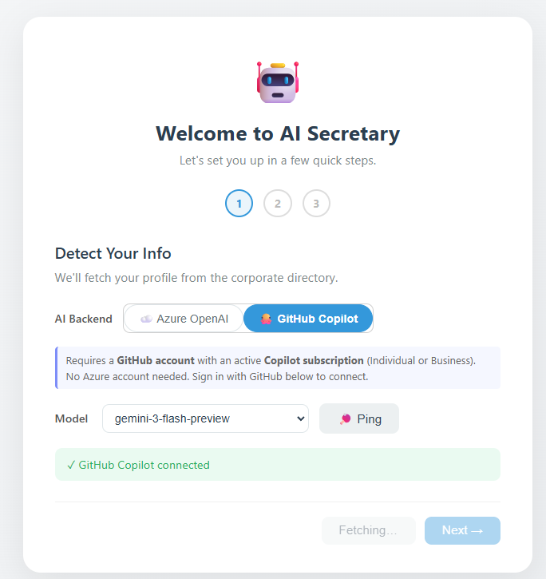
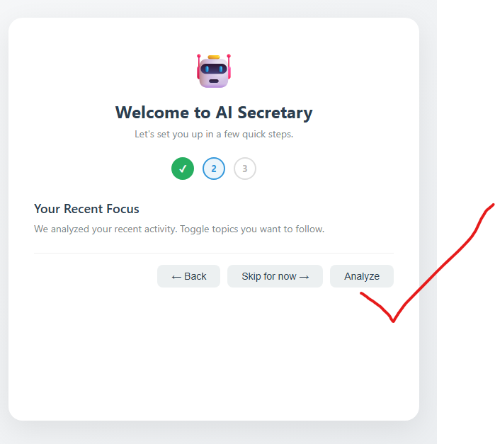
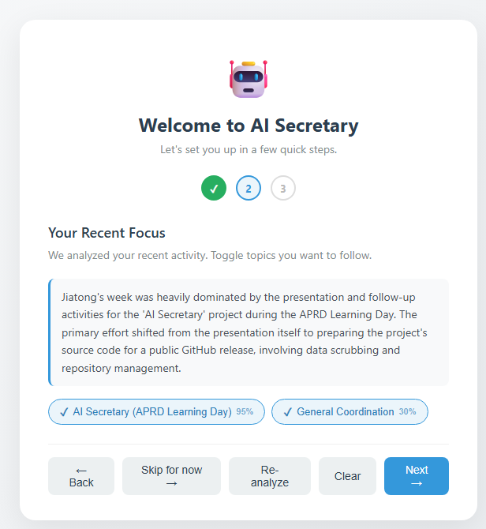
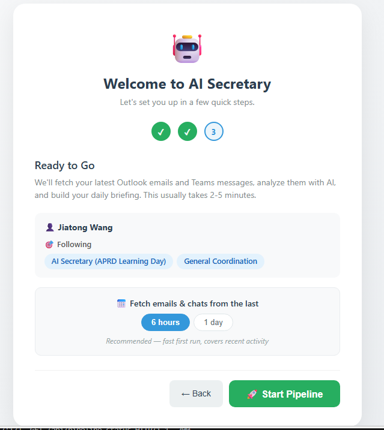
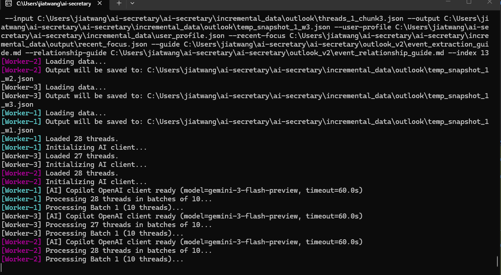
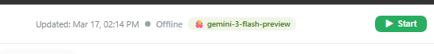
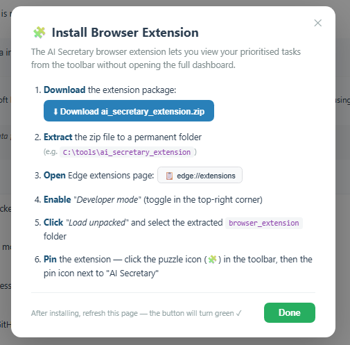

# Getting Started with AI Secretary

This guide walks you through the initial setup of AI Secretary.

## Prerequisites

- A **GitHub account** with an active **Copilot subscription** (Individual, Business, or Enterprise)
- A **Microsoft work account** (for fetching your corporate profile)

> **Note:** Python 3.11, Node.js, and Git will be automatically installed by `start.bat` if not already present.

## Launch the App

> **Recommendation:** Use a **Microsoft DevBox** instead of your local machine. Local corpnet machines have experienced extreme slowness recently due to network policies and endpoint protection. A DevBox gives you a clean, fast environment with full corpnet access.

Open the project folder and launch the setup script using either method:

- **Double-click** `start.bat` in the project root, or
- **Right-click** inside the folder → **Open in Terminal**, then run:
  ```
  .\start.bat
  ```

This will:
- Check and install prerequisites
- Set up a Python virtual environment
- Install dependencies
- Build the frontend
- Start the server and open the dashboard at `http://localhost:5000`

## Step 1: Detect Your Info

On the Welcome screen, you'll configure your AI backend and fetch your corporate profile.

### Sign in with GitHub Copilot

1. Select **GitHub Copilot** as the AI Backend
2. If not already connected, click **Login with GitHub** and complete the device flow in your browser — use your **company GitHub profile**
3. Once connected, you'll see **✓ GitHub Copilot connected**

### Choose a Model

The model dropdown auto-populates after login. Select a model for AI analysis:

- **`gemini-3-flash-preview`** (⭐ Recommended) — Fast and capable, best balance of speed and quality
- Other options include GPT-4o, Claude Sonnet, etc.



### Fetch Your Profile

Your corporate profile is fetched automatically via Microsoft Graph. If it doesn't load, click **Fetch Profile**. You should see your name, email, team, and manager displayed.

Once your profile is loaded and a model is selected, click **Next →**.

## Step 2: Your Recent Focus

AI Secretary analyzes your recent emails, Teams messages, and calendar to identify topics you're actively working on.

1. Click **Analyze** to start the analysis
2. The process takes about **1–2 minutes** — it fetches your recent activity from Microsoft and runs AI analysis
3. Once complete, a list of detected topics will appear — each shows a **relevance score** (e.g., 95%)
4. Toggle topics on/off to customize what the briefing covers
5. You'll also see an AI-generated summary of your recent activity



After analysis completes, you'll see your detected focus areas with relevance scores. Review the topics, toggle any you don't want to follow, then click **Next →**.



> **Tip:** You can click **Skip for now →** and configure this later from Settings.

## Step 3: Start the Pipeline

You'll see a summary of your profile and followed topics. Choose how far back to fetch data:

- **6 hours** (Recommended) — Fast first run, covers recent activity
- **1 day** — Fetches a full day of emails and chats

Click **🚀 Start Pipeline** to kick off the analysis.



The pipeline will:
1. Fetch your recent Outlook emails and Teams messages
2. Extract events, action items, and todos using AI
3. Generate your daily briefing

This usually takes **15–30 minutes** on the first run. A separate terminal window will open showing the pipeline progress — you'll see workers processing your email threads in parallel using the selected AI model.



Once complete, your briefing dashboard will be ready!

## Running the Pipeline Again

After the initial setup, you can trigger a one-time pipeline run anytime from the dashboard header bar. Click the green **▶ Start** button next to your model name.



The status indicator shows:
- **Offline** — Pipeline is idle, ready to start
- **Working** — Pipeline is actively fetching and analyzing
- **Sleeping** — Pipeline is waiting for the next scheduled run

## Installing the Browser Extension

AI Secretary includes a browser extension that lets you view your prioritised tasks from the toolbar without opening the full dashboard.

From the dashboard, click the extension install button to open the installation dialog:

1. **Download** the extension package (`ai_secretary_extension.zip`)
2. **Extract** the zip file to a permanent folder (e.g. `C:\tools\ai_secretary_extension`)
3. **Open** Edge extensions page: `edge://extensions`
4. **Enable** "Developer mode" (toggle in the top-right corner)
5. **Click** "Load unpacked" and select the extracted `browser_extension` folder
6. **Pin** the extension — click the puzzle icon (🧩) in the toolbar, then the pin icon next to "AI Secretary"



After installing, refresh the dashboard page — the extension button will turn green.

## Troubleshooting

| Issue | Solution |
|-------|----------|
| Model dropdown empty | Refresh the page, or re-login with GitHub |
| Profile fetch stuck on "Fetching..." | Ensure Azure CLI is logged in (`az login`) |
| Pipeline starts then quits | Check that `user_profile.json` exists in your data folder |
| Teams fetch hangs | The Substrate API may be slow; click Stop and retry later |
| Port 5000 in use | Close any other instance of AI Secretary first |
